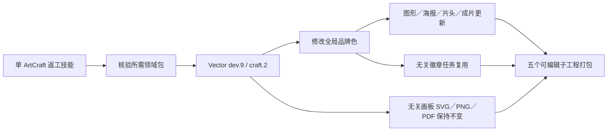

# ArtCraft 混合品牌与矢量资产身份稳定

此前固定 Vector 包 dev.7 在品牌色返工后改变了无关画板 SVG。升级到 dev.8 消除了 SVG 变化，但真实混合执行跨越不同秒，进一步暴露 PDF 日期漂移。修复后的依赖为不可变 Vector 技能源 dev.9／原生 CLI 0.2.0-craft.2。[原失败](evidence/mixed-vector-svg-pdf-failure-20261006.json)、[PDF 失败](evidence/mixed-pdf-date-failure-20261006.json)。

十个技能携带相同的新分发锁。ArtCraft runtime dev.48 保持原字节，只有 Vector 技能包变化；完整公开 Git ZIP 不重写压缩包字节。Node 和其他原生领域版本仍分别锁定。确定性构建器准确重建全部五个锁定包。

单独复制返工技能后，从空目录公开安装运行时／领域包，建立五个原生工程，在不同尺寸和偏移画板间修改全局品牌色，更新四个关联节点并复用独立徽章。无关 SVG／PNG／PDF 字节、画板身份、源工程、旧交付和提供的配音保持不变；关联 PNG 像素实际变化，重复执行复用任务／预算，打包核验五个子工程。合同和真实任务两项测试在 50.356 秒内通过。默认技能源测试通过 66 项、显式跳过 18 项真实场景。[证据](evidence/vector9-brand-mixed-first-use-20261006.json)。

PDF 日期绑定原生工程创建日期或摘要绑定的首次交付日期记录，实际原生修订历史仍可编辑。未知绘制范围和跨画板容器保守保留，不代表所有复合对象成员可以独立导出。上述源码证据未单独关闭 6.33；下文固定安装后的验收补齐此限定范围。ArtCraft 不安装或调用剪映。

最新固定发布验收已通过：ArtCraft dev.50 携带技能源 dev.37，VectorCraft dev.10 携带技能源 dev.9，原生 CLI 0.2.0-craft.2。58 项安装摘要核对通过；真实跨秒 PDF 日期绑定与五节点混合品牌返工通过，任务 4.23／6.33 已按此限定范围关闭。[证据](evidence/codex-release50-vector10-stable-export-first-use-20261006.json)。旧候选／失败证据保持各自范围，完整首版仍未完成。
