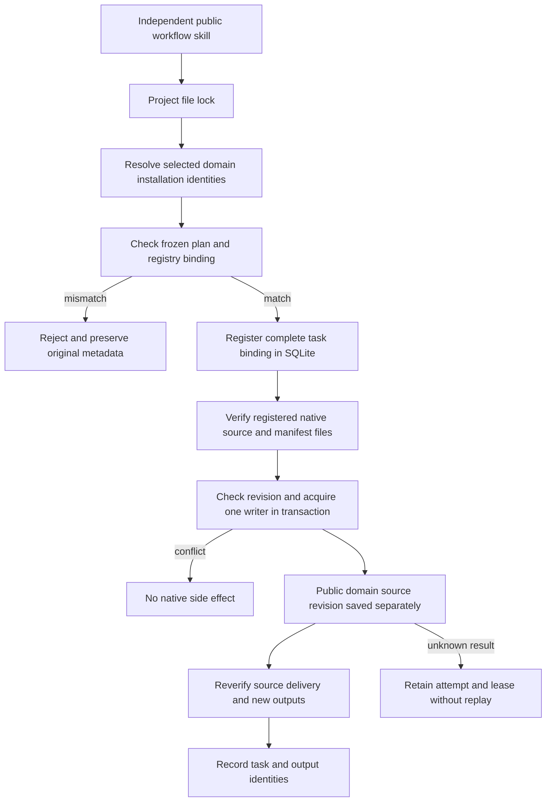

# ArtCraft version binding and single-writer implementation audit

This audit covers AC-TX-001 test and minimal implementation tasks 5.1 and 5.2. Complete real-boundary acceptance, task 5.3, remains open: an actual GUI edit followed by a stale-plan revision_conflict response has not been observed. The normative specification and acceptance criteria remain unchanged.

## Execution architecture

## Technical responsibilities

The independent skill's `skills/artcraft-use/scripts/workflow.py` holds the project file lock throughout installation identity checks, frozen revision checks, metadata publication and runtime execution. Frozen bindings cover the plan, registry, owner and authorization. Conflicts cannot publish replacement installation receipts or registries. All ten skills retain their complete installation and script resources.

The plugin's `src/harness/task_ledger.ts` binds actual plan hashes, input references, revision, runtime identity, authorization, budget and deadline to scoped idempotency keys. A SQLite write transaction checks revision and obtains exclusive project ownership together. Competing OS processes can obtain at most one lease. Unknown results retain their original attempt and lease; process exit alone cannot authorize replay.

`src/adapters/public_skill.ts` resolves only registered native project references, checks manifest files before execution and during verification, and saves revisions through the public --source interface. Arbitrary paths, wrong revisions, missing manifests and source drift are refused. `src/planning/workflow_engine.ts` checks both historical workflow authorization and the producing task's authorization before reuse. A new scope cannot inherit task identities from an old scope.

## Current evidence

The [structured audit](evidence/version-binding-implementation-audit-20261008.json) binds source commits, log hashes, all 29 fixed runtime files and installed skill tree hashes. A historical version reproduces metadata changes before rejecting a binding conflict using actual filesystem byte inventories. Installation and runtime responses in this RED test are controlled substitutes; this is not a native failure claim.

The complete current runtime regression has 275 tests: 255 pass and 20 conditional skips. The source skill suite has 177 tests: 137 pass and 40 conditional skips. The independently installed skill uses an empty cache and public downloads to create four-domain outputs, revise four registered native projects, reuse identical tasks, preserve original outputs, reject runtime identity conflicts and verify relocated packages. Native hashes and source inspections are retained. Generated tone audio and procedural graphics do not establish creative acceptance.

## Status and limits

Execution contents of runtime122, source94 and plugin122 remain unchanged. This audit adds implementation evidence and task status; it does not publish replacement skill or runtime artifacts. Actual GUI observation, other platforms, complete protocol acceptance and complete V1 qualification remain open. Automated manifest-drift checks and SQLite revision conflicts cannot substitute for actual GUI interaction.
