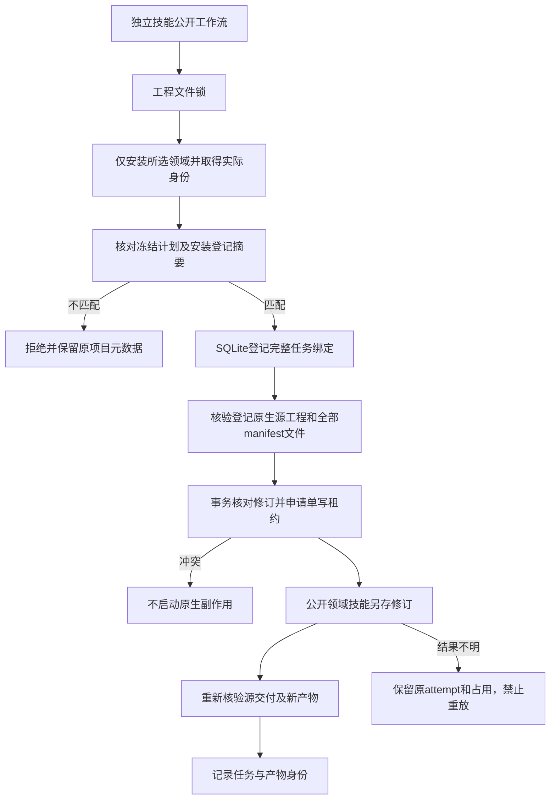

# ArtCraft 版本绑定与单写实施核验

本次核验对应 AC-TX-001 的测试与最小实现任务 5.1、5.2。完整真实边界验收 5.3 继续开放：尚未观察用户在实际 GUI 修改工程后，旧计划返回 revision_conflict 的全过程。规范与验收标准保持不变。

## 执行架构

## 技术分工

独立技能源 `skills/artcraft-use/scripts/workflow.py` 在工程文件锁内完成安装身份核对、冻结修订校验、登记材料发布和运行时调用。冻结绑定涵盖计划、登记表、owner与授权；冲突时不发布新的安装回执和登记表。十个技能保留各自完整的安装与脚本资源。

插件 `src/harness/task_ledger.ts` 将实际计划摘要、输入引用、修订、运行时身份、授权、预算与期限绑定到幂等键。SQLite写事务同时执行版本核对和单写占用；不同OS进程争用同一工程最多取得一个租约。不明确结果保留原attempt及占用，进程退出本身不允许重放。

`src/adapters/public_skill.ts` 只解析登记素材的原生工程引用，核验manifest中的文件，准备和验收时重复核验源交付，并通过公开 --source 另存修订。任意路径、错误修订、缺少manifest及源文件漂移均拒绝。`src/planning/workflow_engine.ts` 复用时同时核对历史工作流及原生产任务的授权范围；新授权不会继承旧授权任务身份。

## 当前证据

[结构化核验记录](evidence/version-binding-implementation-audit-20261008.json) 绑定源码提交、测试日志摘要、固定运行时29项文件及已安装技能整树摘要。历史版本通过实际文件字节比较复现“冲突拒绝前改写元数据”；安装与运行时响应在该红灯测试中为受控替身，不能称作原生失败。

当前完整运行时回归275项：255通过、20条件跳过；技能源177项：137通过、40条件跳过。独立已安装技能在空缓存中通过公开下载完成四领域创建、四原生源工程另存返工、重复任务复用、原产物保全、运行身份冲突拒绝及移动包核验。证据记录各原生工程摘要和源检查，测试生成的配音与图形不代表创作验收。

## 状态与限制

固定runtime122、source94及plugin122的执行内容不变；本次只补齐实施证据与任务状态，不发布新的技能或运行时。GUI观察、其他平台、完整公共协议与全部V1验收仍需各自证据。manifest漂移阻断及SQLite修订冲突是自动化证据，不能替代GUI真实操作。
