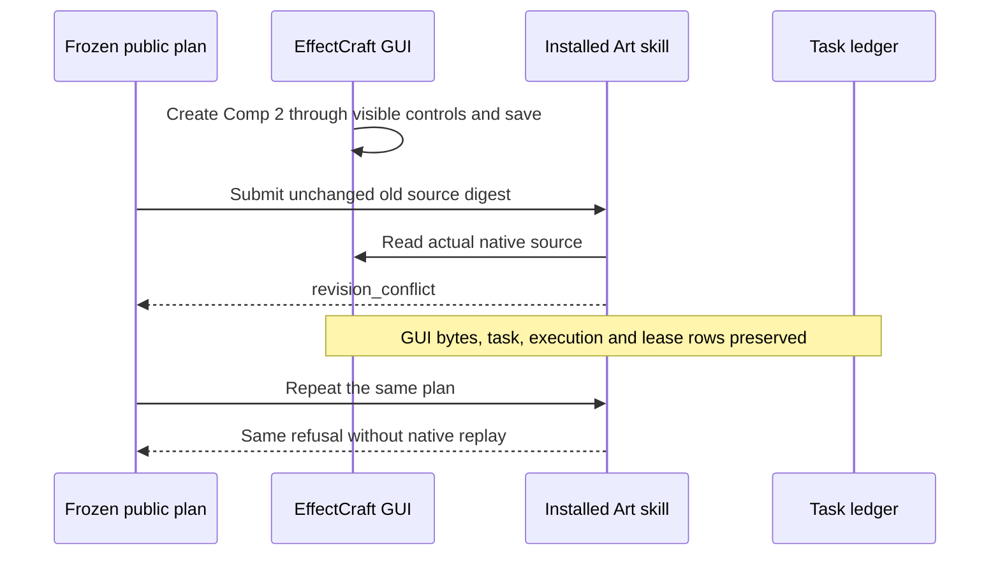

# ArtCraft fixed version and single-writer acceptance

Task5.3 (AC-TX-001) is complete on plugin135/source107/runtime134-runtime.1, macOS arm64. The isolated Codex installation discovers64 skills with zero errors. This acceptance uses verified warm native dependency caches; generic Skills CLI and cold installation are separate gates.

| Requirement scene | Current evidence |
| :--- | :--- |
| AC-TX-001-P | Eight real native creations; recorded producing-task identity and request digests. Four domain pairs sharing projectKey/source serialize through verification; independent workers overlap. |
| AC-TX-001-N | Actual EffectCraft GUI creates/saves a second composition. Original and new compositions reopen natively. The fixed installed public cli refuses the frozen old plan twice with exact revision_conflict; native bytes and tasks/executions/leases remain unchanged. |
| Registered source revision | Eight actual source revisions across four domains; requested dimensions checked after reopen where applicable; source trees preserved and replay keeps original events/tasks/budget. |
| AC-TX-001-META | Plan, authorization, input and launcher conflicts preserve every project file and ledger table. |
| AC-TX-001-CACHE | Same authorization reuses producing tasks; a new authorization produces its own four tasks. Original deliveries remain intact; moved four-child package verifies. |

[Fixed aggregate evidence](evidence/version-single-writer-fixed135-20261009.json) binds the public releases, raw proof digests, GUI screenshot/reopen evidence and current host records. The version-binding fixture's own remaining list describes its individual coverage; current GUI and single-writer records supply those two formerly missing parts. Earlier candidate/read-only/CUA limitations retain their historical scope and are superseded for this requirement by the native GUI route.

The GUI edit was recorded before publication and then rechecked through fixed installed entrypoints. No new screenshot edit or synthetic project mutation substitutes for that record. Runtime571/25, source154/52 and plugin Python112/11 are prior current-source pass/conditional-skip counts. This checkpoint adds actual host, creation, source revision, concurrency and installed refusal evidence; it does not relabel all conditional tests as executed. Eleven numbered tasks remain open, including protocol matrices, generic Skills CLI, full runtime capability acceptance and formal release/permissions gates. Full V1 is not achieved; OpenSpec stays active.
