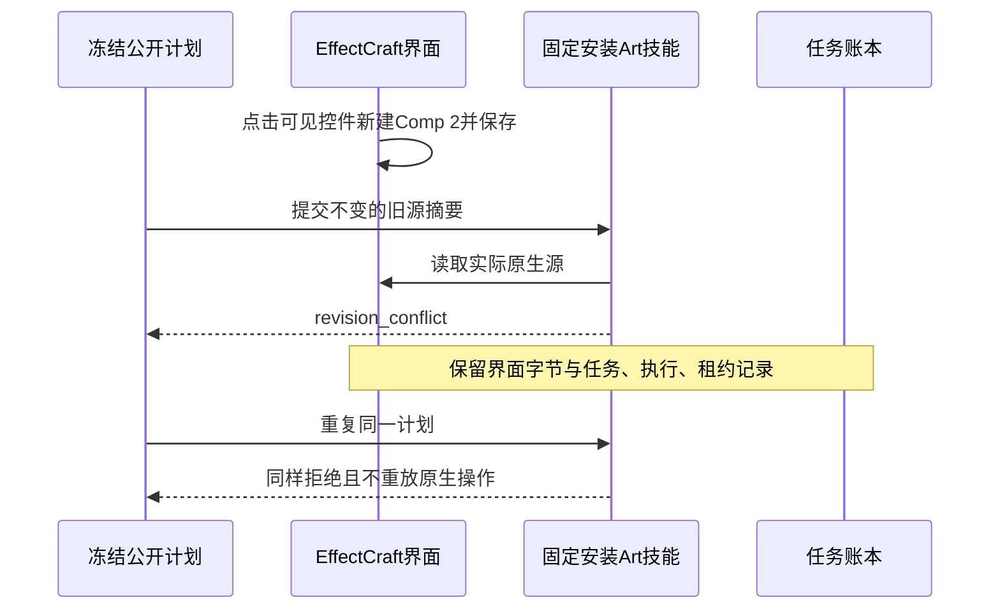

# ArtCraft 固定版本与单写入者验收

任务5.3（AC-TX-001）在插件135／技能源107／runtime134-runtime.1、macOS arm64上完成。隔离Codex安装发现全部64项技能，零加载错误。本次使用已核验的暖原生依赖缓存；通用Skills CLI与空缓存安装是独立门禁。

| 需求场景 | 当前证据 |
| :--- | :--- |
| AC-TX-001-P | 8个真实原生创建，保存生产任务身份与请求摘要。四领域共享projectKey／源工程的双分支串行至核验完成；独立工作进程存在实际重叠。 |
| AC-TX-001-N | 真实EffectCraft界面新建并保存第二个合成，原合成与新合成都能原生重开。固定安装公开cli两次拒绝冻结旧计划，精确返回revision_conflict，工程字节和tasks／executions／leases均不变。 |
| 登记源工程修订 | 四领域8个真实源修订，适用时原生重开检查请求尺寸；源交付树不变，重复执行保留事件、任务与预算。 |
| AC-TX-001-META | 计划、授权、输入、启动器四类冻结冲突保留全部项目文件及账本表内容。 |
| AC-TX-001-CACHE | 同授权复用生产任务，新授权建立自己的4个任务；旧交付保全，移动后的4子工程包核验通过。 |

[固定版本聚合证据](evidence/version-single-writer-fixed135-20261009.json)绑定公开发行、原始证明摘要、界面截图／重开及当前宿主记录。版本绑定夹具自身的remaining列表只描述该夹具覆盖，当前GUI与单写验收补齐其中原先两项缺口。此前候选、只读bridge与CUA限制保留历史范围；本需求的界面缺口由原生GUI路径补齐。

界面修改发生在发布之前，发布后通过固定安装入口重新核验；没有以新截图编辑或合成文件修改替代真实记录。此前当前源码回归计数为运行时571通过／25条件跳过、技能源154／52、插件Python112／11。本检查点新增真实宿主、创建、源修订、并发及安装后拒绝证据，不把全部条件跳过项改称已执行。仍有11项编号任务开放，包括公共协议矩阵、通用Skills CLI、完整运行能力及正式发布／权限门禁。完整V1未完成，OpenSpec继续实施。
