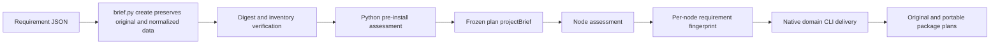

# ArtCraft Versioned Brief Architecture

Current seven-scenario acceptance and tasks6.2/6.3 are complete;see [current architecture](ArtCraft-Brief-Acceptance-Architecture.md). Open6.2/6.3 statements below describe the earlier test checkpoint. The specification has seven scenarios;the earlier eight-scenario count was incorrect.

2026-10-08 evidence update: 19 shared constraint cases agree between the Python skill and TypeScript runtime. Historical commit `5311ec6` fails two duration cases in a replay performed after implementation; this is not an original TDD log. Runtime regression: 278 passed / 21 conditional skips; skill-source regression: 137 passed / 46 conditional skips. Task 6.1 positive/negative tests are complete; the implementation audit in 6.2 and all eight native/installed acceptance scenarios in 6.3 remain open. Only tests and documentation change; all 33 fixed runtime files and ten independent Brief script copies match. No new release is needed. See [evidence](evidence/brief-contract-parity-20261008.json).

Status: immutable release, cold single-skill first use and bounded installed-host integration passed. OpenSpec AC-DM-001-BRIEF / task 6.23 is verified. Runtime dev.28 has an immutable published archive pinned by skills dev.25; plugin dev.29 vendors that immutable snapshot.

A Brief is requirement metadata: version, owner, authorization scope, budget, native format, dimensions, optional frame rate/duration, brand, subjects, versioned references, upload policy and unresolved questions. It is not a media input.



Unsupported formats, prohibited uploads, declared dimension/font/color conflicts, stale references and unresolved questions block execution. Assessment lists affected consumers and independent checks; execution rejects the entire blocked plan. Missing deliverable nodes cannot yield ready. Source-project plans without document metadata require further inspection; cloud executors remain unavailable.

Python accepts --brief and --brief-sha, verifies the exclusive record directory and freezes normalized data into the plan. Both Node CLI and WorkflowEngine assess projectBrief before task registration. Fingerprints contain only applicable deliverable/brand/subject constraints, excluding the global Brief revision. Plans without a Brief retain their historical fingerprint.

Records contain input.json, brief.json and manifest.json; overwrites, extra files, symlinks and changed hashes are refused. Moved records verify. Changing requirements in an existing workflow revision conflicts without modifying existing project files. Original and portable package plans preserve the Brief and are hash-bound by the package manifest. References use AssetRef rather than user absolute paths.

Evidence: source suite 71 tests, 59 passed and 12 optional first-use/native skips; Node suite 94 tests, 89 passed and 5 optional integration skips. Four-domain native integration covers creation, Logo revision, separate source revisions, public CLI replay, moved native packages and preserved prior outputs. Brief integration uses an existing local cache, not a cold install, new host discovery or creative acceptance.

Remaining: generic Skills CLI installation and model dispatch verification. Source-project Brief inspection and complete duration assessment need extension. The overall goal remains incomplete; only task 6.23 is complete; the overall specification remains unarchived.

Candidate skills dev.25 pass isolated single-skill online Brief testing: 3 tests, 98.048 seconds, system Python 3.14.3. Native output and frozen-plan hashes are recorded in versioned-brief-first-use.json; immutable skill publication and installed-host proof remain pending.

Fixed plugin dev.29 / skills dev.25 / runtime dev.28 pass installed-skill online first-use verification: 3 tests, 89.841 seconds; all 58 installed skill hashes unchanged and zero loading errors. See codex-release29-brief-native-20261006.json. Generic Skills CLI installation, model dispatch and creative acceptance remain unverified.

Run the test from the standalone `artcraft-skills` repository. Set `ARTCRAFT_PLUGIN_SOURCE` to verified ArtCraft plugin source and `NODE_EXECUTABLE` to a Node 24+ executable. This test installs no tools and skips without explicit configuration. The 19 cases are subscenarios within one test method, not 19 native acceptance runs.

```sh
CRAFT_BRIEF_PARITY_RUNTIME="$ARTCRAFT_PLUGIN_SOURCE" \
CRAFT_BRIEF_PARITY_NODE="$NODE_EXECUTABLE" \
python3 -I -B -m unittest discover -s tests -p test_brief_contract_parity.py -v
```
