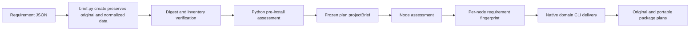

# ArtCraft Versioned Brief Architecture

Status: source implementation and bounded integration passed; unpublished. OpenSpec AC-DM-001-BRIEF / task 6.23 remains open. Runtime dev.28 has an immutable published archive pinned by candidate skills dev.25; the plugin skill snapshot has not been updated.

A Brief is requirement metadata: version, owner, authorization scope, budget, native format, dimensions, optional frame rate/duration, brand, subjects, versioned references, upload policy and unresolved questions. It is not a media input.

Unsupported formats, prohibited uploads, declared dimension/font/color conflicts, stale references and unresolved questions block execution. Assessment lists affected consumers and independent checks; execution rejects the entire blocked plan. Missing deliverable nodes cannot yield ready. Source-project plans without document metadata require further inspection; cloud executors remain unavailable.

Python accepts --brief and --brief-sha, verifies the exclusive record directory and freezes normalized data into the plan. Both Node CLI and WorkflowEngine assess projectBrief before task registration. Fingerprints contain only applicable deliverable/brand/subject constraints, excluding the global Brief revision. Plans without a Brief retain their historical fingerprint.

Records contain input.json, brief.json and manifest.json; overwrites, extra files, symlinks and changed hashes are refused. Moved records verify. Changing requirements in an existing workflow revision conflicts without modifying existing project files. Original and portable package plans preserve the Brief and are hash-bound by the package manifest. References use AssetRef rather than user absolute paths.

Evidence: source suite 71 tests, 59 passed and 12 optional first-use/native skips; Node suite 94 tests, 89 passed and 5 optional integration skips. Four-domain native integration covers creation, Logo revision, separate source revisions, public CLI replay, moved native packages and preserved prior outputs. Brief integration uses an existing local cache, not a cold install, new host discovery or creative acceptance.

Remaining: immutable release artifacts, plugin snapshot synchronization and installed-host validation. Source-project Brief inspection and complete duration assessment need extension. The overall goal remains incomplete; task 6.23 and specification archive remain open.

Candidate skills dev.25 pass isolated single-skill online Brief testing: 3 tests, 98.048 seconds, system Python 3.14.3. Native output and frozen-plan hashes are recorded in versioned-brief-first-use.json; immutable skill publication and installed-host proof remain pending.
