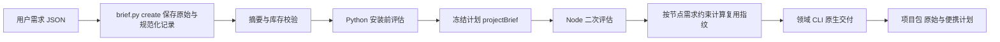

# ArtCraft 版本化 Brief 架构

状态：源实现及有界联调通过，未发布；OpenSpec AC-DM-001-BRIEF / 任务 6.23 仍未完成。运行时 dev.28 已发布不可变制品，候选技能 dev.25 锁定该制品；插件内技能快照尚未更新。

Brief 是需求元数据，包含版本、拥有者、授权范围、预算、原生交付格式、尺寸、可选帧率/时长、品牌、主体、参考素材版本、上传政策与未解决歧义。它不作为媒体输入，不让领域适配器消费虚假素材。

未知格式、禁止上传、声明尺寸或字体/配色不一致、参考版本过期、未确认歧义会阻塞；评估报告列出受影响消费者和独立节点，但执行入口拒绝整个阻塞计划。缺少交付节点不得被误报为 ready。源工程计划没有 document 时要求进一步检查，不假定尺寸已知；云执行器尚未接入。

Python 公开入口支持 --brief 与 --brief-sha，读取带摘要的独占记录目录，并把规范化数据写入冻结计划。Node CLI 和 WorkflowEngine 都在登记任务前校验 projectBrief。节点指纹仅包含该节点的交付约束及适用品牌/主体，不含全局 Brief 修订号；已有无 Brief 的计划保持原指纹。

需求记录保存 input.json、brief.json、manifest.json，拒绝覆盖、额外文件、符号链接和摘要变化；移动后可重验。同一工作流修订改变需求发生冲突，已有文件不变。项目包的原始与便携计划均保留 Brief，包清单摘要绑定这些计划；参考仅使用 AssetRef，不写用户绝对路径。

证据：源技能 71 项测试，59 通过、12 可选首次使用/原生测试跳过；Node 回归 94 项，89 通过、5 可选联调跳过。真实四领域联调覆盖新建、Logo 改动、源工程独立修订、CLI 重开、原生包移动及旧产物保留。Brief 原生联调复用本机缓存；不是冷安装、宿主新技能发现或最终创作接受。

待完成：固定制品发布、插件发布快照同步、安装宿主验证；源工程 Brief 元数据检查与完整时长判断仍需扩展。最终目标尚未完成，不勾选任务 6.23，不归档规范。

候选技能 dev.25 的隔离单技能在线 Brief 测试通过：3 项，98.048 秒，系统 Python 3.14.3。真实原生交付及冻结计划摘要见 versioned-brief-first-use.json；固定发布与安装宿主复验仍待完成。
