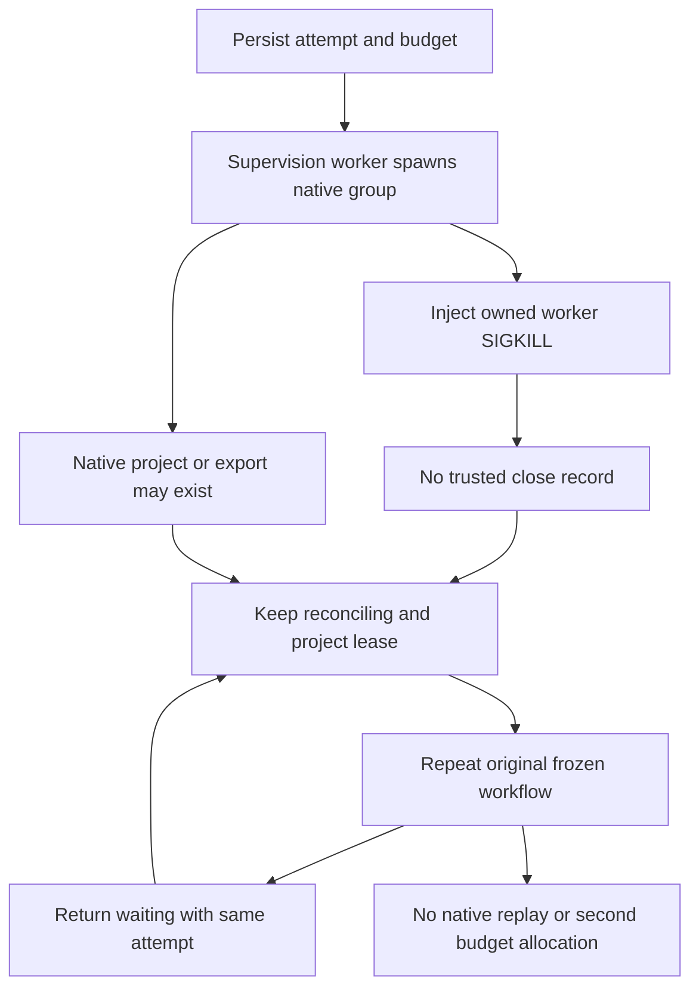

# ArtCraft Worker Crash Architecture

The fixed installed system is plugin100/source74/runtime83 with Film29, Effect30, Photo30 and Vector29. The test driver is separate from the installed skill, which is copied alone into an empty environment using default public downloads.

The test validates the worker's parent chain before injecting the fault. Process disappearance is observed only by the test; it cannot authorize a ledger transition. Both repeated recovery calls retain the running execution record with no stop evidence, original token/attempt and budget, one spawn event and unchanged artifacts. Test cleanup affects only its verified process group and retains temporary files if stopping cannot be confirmed.

The first driver attempt failed because it assumed top-level state, whereas the published public Python entrypoint wraps nonzero workflow receipts in its error JSON. The driver now decodes the existing contract. This was not accepted as a product failure or successful acceptance.

The fixed native test passes (38.836s); default source regression passes104 of138 tests with34 opt-in skips. All64 installed metadata/tree hashes remain unchanged. A stopped supervisor does not establish a stopped native execution. This proof does not add an administrative settlement operation, auto-release a lease, or prove the pre-spawn submission window, concurrent recovery, creative acceptance or complete V1.

[Evidence / 证据](evidence/artcraft100-worker-crash-first-use-20261007.json).
