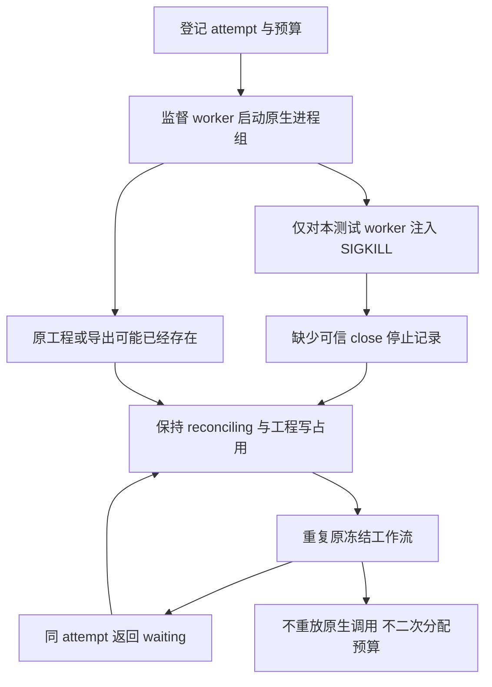

# ArtCraft Worker 崩溃架构

固定安装身份为插件100／源74／运行时83，领域包为Film29、Effect30、Photo30、Vector29。测试驱动独立于安装技能；只复制恢复技能，使用空环境和默认公开下载。

注入前核验worker所属父进程链。进程消失仅由测试观察，不能授权账本状态转换。两次恢复保持没有停止证据的running执行记录、原token／attempt及预算，启动事件仅一条，原产物字节不变。清理只涉及核验过的测试进程组，无法确认停止时保留临时文件。

首轮测试误以为返回顶层state，实际公开Python入口将非零工作流回执封装在error JSON中；已修正测试解码既有合同。这次失败不作为产品失败或验收成功。

固定安装原生用例通过（38.836秒）；默认源回归138项中104项通过、34项需显式环境而跳过。64个安装技能元数据及目录哈希保持。监督器停止不能证明原生执行停止。本证据不新增管理员收敛操作、不自动释放写占用，也不证明启动前提交窗口、并发恢复、创作接受或完整V1。

[Evidence / 证据](evidence/artcraft100-worker-crash-first-use-20261007.json).
