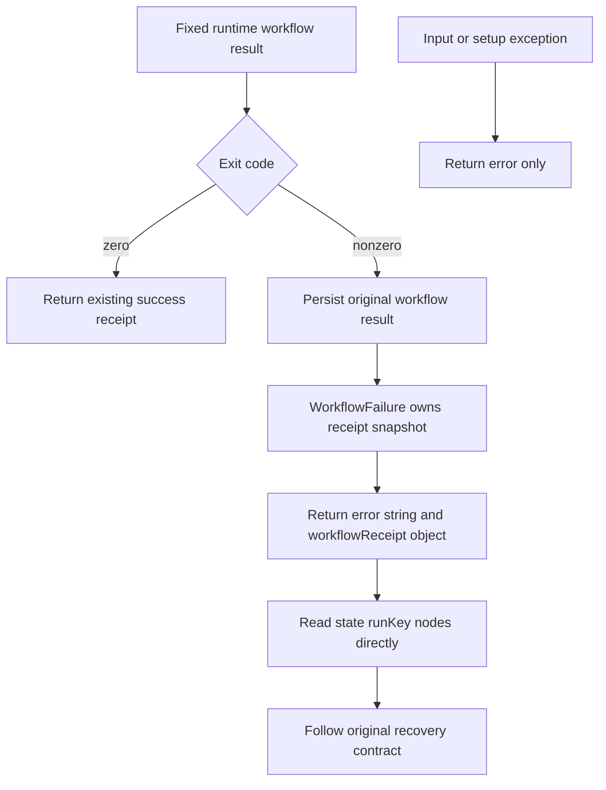

# ArtCraft Structured Workflow Receipt Architecture

Source75 adds an optional object field to the public Python workflow failure reply. The existing error string and nonzero exit code remain compatible; successful replies remain unchanged. Runtime83, native binaries, domain source bundles and their immutable2646-command index remain unchanged.

Only the explicit WorkflowFailure type carries a receipt. Arbitrary exception text is not parsed into a trusted workflow result. Both representations derive from one serialized snapshot, and the structured reply matches the persisted result with projectRoot. Waiting remains non-success and preserves the original task/lease/budget requirements; this is not an automatic settlement or replay policy.

Ten independent skills carry their own mirrored workflow and recovery guide. Tests expose the prior absent field, verify exact stored/returned identity and one runtime invocation, and verify ordinary input failures do not invent a receipt. The candidate public-download worker fault test validates structured waiting replies on three observations, with one native spawn and preserved original artifacts. Fixed plugin101/source75 publication, isolated-host install, all-ten cold starts and native installed acceptance are separate gates.

[Candidate evidence / 候选证据](evidence/artcraft75-structured-workflow-receipt-candidate-20261007.json).
