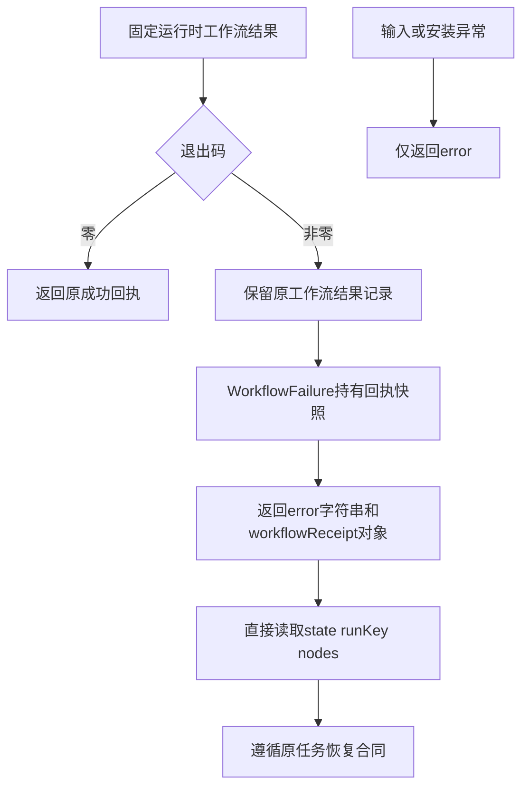

# ArtCraft 结构化工作流回执架构

源75为公开Python工作流失败返回增加可选对象字段。既有error字符串及非零退出码保持兼容；成功回执不变。运行时83、原生二进制、领域技能源包及不可变2646条命令索引均保持不变。

只有明确的WorkflowFailure类型携带工作流回执，不将任意异常文本解析成可信工作流结果。两种表示来自同一序列化快照，结构化结果与保存在项目中的含projectRoot回执一致。waiting仍为非成功，不改变原任务、写占用和预算要求；不新增自动收敛或重放策略。

十个独立技能各自携带镜像入口和恢复说明。测试先暴露字段缺失，再校验保存与返回一致、仅调用一次运行时以及普通输入错误不伪造回执。候选公开下载worker故障测试验证三次结构化等待观察，原生启动一次且保全原产物。固定插件101／源75发布、隔离宿主安装、十技能冷启动及原生安装验收分别执行。

[Candidate evidence / 候选证据](evidence/artcraft75-structured-workflow-receipt-candidate-20261007.json).
