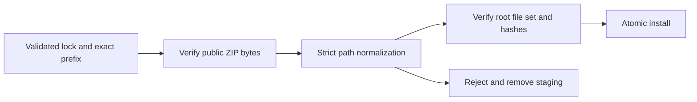

# Pinned domain archive layout

Art distribution declares archivePrefix only for a Git ZIP from a known domain skills repository. The prefix must exactly equal its repository name plus slash. The public ZIP remains unchanged: archive size and SHA-256 are checked before extraction, paths are normalized only by removing the declared prefix, and all installed root files must match the locked file set and hashes. Root archives keep their existing behavior.

Mixed roots, traversal, duplicate entries, symlinks, unexpected files and mismatched content are refused before publishing the installation directory. Invalid prefix locks fail before download or directory creation. The immutable builder uses git archive with the same explicit prefix and preserves canonical root file hashes.

The source dev.81 candidate now pins Film35, Effect34, Photo33 and Vector31 with runtime108. Five exact archives reconstruct and a real source-candidate Photo public cold creation/revision/package case passes. Source-tag/full-plugin and all ten installed standalone Art skills acceptance remain pending; this does not close complete V1 or protocol requirements.

Subsequent fixed-release qualification covers Art109/source81/runtime108: 64 host-discovered skills and CLI entries, 16 installed authority file digests, and ten Art native Photo creation/revision/moved-package cases, each with its own empty public cache. Fifty-four unchanged domain skills retain historical proof. The prior candidate document records its earlier phase; complete V1 and generic Skills CLI installation remain open. [Fixed evidence](evidence/craft-archive-prefix-fixed-first-use-20261008.json).
