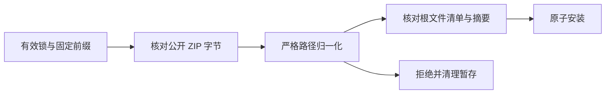

# 固定领域归档布局

Art 分发只允许来自已知领域技能仓库的 Git ZIP 显式声明 archivePrefix；值必须严格等于仓库名加斜杠。公开 ZIP 保持原字节：先核对归档大小及 SHA-256，仅移除声明的固定前缀，再以根目录文件清单和逐文件摘要核验安装结果。原有根布局行为保持兼容。

混合根布局、逃逸、重复条目、符号链接、未知文件及内容摘要错误均在发布安装目录前拒绝。非法前缀锁在下载和创建目录前失败。不可变重建器使用同一固定前缀执行 git archive，文件摘要仍以规范化根路径记录。

技能源 dev.81 候选现固定 Film35、Effect34、Photo33、Vector31 和 runtime108。五个归档精确重建通过，真实源码候选 Photo 公开空缓存创作／返工／打包用例通过。技能源标签、完整插件与十个已安装独立 Art 技能的完整验收仍待完成，完整首版及协议需求继续开放。

后续固定发行验收已完成上述安装边界：Art109／源码81／运行时108；64 项宿主发现与 CLI 入口、16 项协议文件摘要、十项各自空缓存的 Art 原生 Photo 创建／返工／迁移打包通过。54 项未变领域技能保留原历史证据。先前候选证据为阶段快照；完整首版与通用 Skills CLI 安装仍开放。[固定证据](evidence/craft-archive-prefix-fixed-first-use-20261008.json)。
