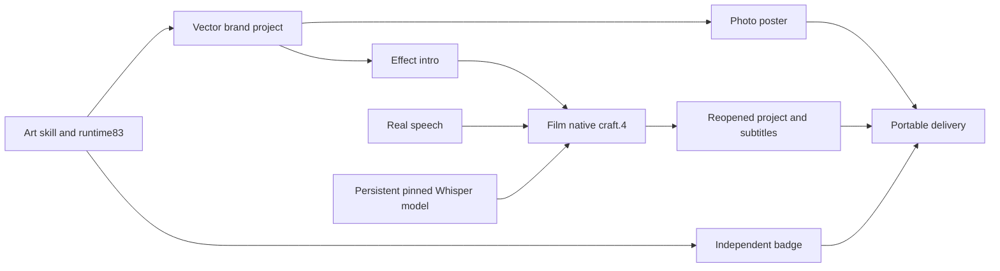

# 混合工程真实语音识别 / Real speech in mixed projects

源 dev.79 候选将 Film 分发固定到源 dev.34／原生 craft.4；Art 编排运行时继续使用不可变 dev.83。完整命令目录仍为 2,639 条，领域参数、实时 enabled 和原生摘要校验继续生效。固定 Art104 尚未包含此分发，不能用它证明本场景。

Source dev.79 pins Film source dev.34/native craft.4 while retaining immutable Art runtime dev.83. All 2,639 command routes retain parameter, live enabled and native identity validation. Fixed Art104 does not include this distribution.

## 安装、模型与目录 / Setup, model and directory

1. 确定当前技能的真实安装位置 `ART_SKILL_DIR`（独立 `.agents/skills/artcraft-cli-assets` 或宿主插件内的技能目录）。执行该目录下的 `scripts/bootstrap.py --runtime-home "$CRAFT_RUNTIME_HOME" --plugin filmcraft`。选择 Film 时只安装 Art 运行时和 Film；混合计划再按需增量安装其他领域。
2. 声明绝对持久目录 `FILMCRAFT_DATA_DIR`，在启动 Art 前设置。模型位于该目录的 `models/whisper-tiny`，与运行时安装目录分离。下载、识别和返工必须使用同一目录。
3. 使用安装回执 `skills.filmcraft.executable` 指向的固定 CLI，先执行 `exec transcript.models --data-dir "$FILMCRAFT_DATA_DIR"`，确认 `available=true`；再执行 `exec transcript.downloadModel '{"model":"whisper-tiny"}' --data-dir "$FILMCRAFT_DATA_DIR"`。
4. 使用多语言 Whisper tiny，固定 Hugging Face 修订 `169d4a4341b33bc18d8881c4b69c2e104e1cc0af`，四文件约154MB。模型权重采用 MIT，Hugging Face 转换代码采用 Apache-2.0；权重不内置、不提交或随交付包分发。下载器检查新下载文件摘要，验收还须核对已存在文件。具体四文件摘要见本源分发所引用的 Film 转录指南；另行使用 **filmcraft-cli-transcript** 技能时安装命令为 `npx skills add full-aigc-skills/filmcraft-skills --skill filmcraft-cli-transcript`。

Set `ART_SKILL_DIR` to the installed skill directory and bootstrap only needed domains. Set an absolute persistent `FILMCRAFT_DATA_DIR` before launching Art. Use the executable declared by the setup receipt to inspect and download the pinned multilingual tiny model. Keep weights outside deliveries; verify existing files as well as new downloads. Do not infer model readiness from CLI installation alone.

## 混合计划 / Mixed plan




在 Film 节点的 `payload.plan.operations` 中，先真实导入配音并绑定 `voice.item`，再添加以下原生命令；识别文本由模型产生，不把参考文稿作为识别输入：

```json
[
  {"command":"native.command","params":{"command":"transcript.generate","params":{"model":"whisper-tiny","language":"en","items":[{"$ref":"voice.item"}]}}},
  {"command":"native.command","params":{"command":"transcript.createCaptions","params":{"name":"Recognized speech","maxChars":42}}}
]
```

Import real speech and bind `voice.item` before these operations. Use the full [brand workflow](../examples/brand-token-campaign.json) as the dependency pattern: Logo → poster/intro → film, with an unrelated badge. Remove provided caption text if the task requires generated subtitles. Chinese, noisy audio, multi-speaker and long-form accuracy require their own acceptance; the current retained example uses English speech.

## 返工、失败与验收 / Revision, failure and acceptance

- Logo 返工引用原生工程 SHA、源产物和已保存的品牌对象引用；更新相关海报、片头和视频，保留无关徽标及原始交付。以实际像素、工程重开、字幕及移动包核验，不仅检查 task ID。
- 明确失败的模型下载可在同一目录恢复。unknown 的识别或修改操作必须先核对回执、暂存工程与执行身份，不自动重放。
- 分别记录源技能候选、公开源、固定插件宿主、实际混合 DAG、创作质量和完整 V1。状态 `review_ready` 表示等待创作评审，不代表人工已认可。

Reference native project hashes and stable brand bindings for revision. Check changed pixels, reopened projects, subtitles and moved packages, and preserve unrelated nodes and originals. Retry only explicitly failed downloads; reconcile unknown edits before resuming. Keep source, fixed host, mixed execution and human creative acceptance separate.
