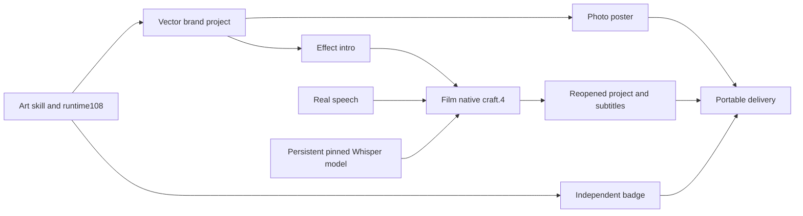

# 混合工程真实语音识别 / Real speech in mixed projects

当前源dev.83将Film分发锁定到源dev.36／原生craft.4，Art编排运行时仍为不可变dev.108；四领域目录为2,646条（666／640／755／585）。按当前实际安装锁核对，不把旧Art104或其他不可变版的指南用于证明新版。本次新增操作模板和字号交接，不改变原生运行时或领域分发锁。

Source83 pins Film source36/nativecraft.4 and immutable Art runtime108. Four-domain discovery contains2,646 commands (666/640/755/585). Verify the loaded installation's lock. This revision adds a caption handoff template without changing native/runtime dependencies.

## 安装、模型与目录 / Setup, model and directory

1. 确定当前技能的真实安装位置 `ART_SKILL_DIR`（独立 `.agents/skills/artcraft-cli-recover` 或宿主插件内的技能目录）。执行该目录下的 `scripts/bootstrap.py --runtime-home "$CRAFT_RUNTIME_HOME" --plugin filmcraft`。选择 Film 时只安装 Art 运行时和 Film；混合计划再按需增量安装其他领域。
2. 声明绝对持久目录 `FILMCRAFT_DATA_DIR`，在启动 Art 前设置。模型位于该目录的 `models/whisper-tiny`，与运行时安装目录分离。下载、识别和返工必须使用同一目录。
3. 使用安装回执 `skills.filmcraft.executable` 指向的固定 CLI，先执行 `exec transcript.models --data-dir "$FILMCRAFT_DATA_DIR"`，确认 `available=true`；再执行 `exec transcript.downloadModel '{"model":"whisper-tiny"}' --data-dir "$FILMCRAFT_DATA_DIR"`。
4. 使用多语言 Whisper tiny，固定 Hugging Face 修订 `169d4a4341b33bc18d8881c4b69c2e104e1cc0af`，四文件约154MB。模型权重采用 MIT，Hugging Face 转换代码采用 Apache-2.0；权重不内置、不提交或随交付包分发。下载器检查新下载文件摘要，验收还须核对已存在文件。具体四文件摘要见本源分发所引用的 Film 转录指南；另行使用 **filmcraft-cli-transcript** 技能时安装命令为 `npx skills add full-aigc-skills/filmcraft-skills --skill filmcraft-cli-transcript`。

Set `ART_SKILL_DIR` to the installed skill directory and bootstrap only needed domains. Set an absolute persistent `FILMCRAFT_DATA_DIR` before launching Art. Use the executable declared by the setup receipt to inspect and download the pinned multilingual tiny model. Keep weights outside deliveries; verify existing files as well as new downloads. Do not infer model readiness from CLI installation alone.

## 混合计划 / Mixed plan




在 Film 节点的 `payload.plan.operations` 中，先真实导入配音并绑定 `voice.item`，放置音画，再追加本技能 `examples/mixed-asr-operations.json` 的操作数组。它是Film节点的操作片段，不是完整Art DAG；完整依赖模式使用本技能brand-token-campaign.json。复制模板到任务目录修改，不改安装副本。识别文本由模型产生，不把参考文稿作为识别输入。

新建且要求自动字幕的计划，移除所复制模板中captions.newTrack、captions.setStyle与caption.add占位操作，保持音画操作。已有用户工程先查询真实字幕轨道，仅关闭任务明确替换的占位轨道；保留文字与时间，不自动关闭无关字幕。音频按实际媒体长度安排，不要用视频时长强制越界音频源。

操作片段先识别，再以maxChars32、lines1生成字幕并绑定speechCaptions；样式引用speechCaptions.track的实际返回ID，不猜测C1。默认Arial、size84、margin0.02针对180高英语示例，名义14px；底部单行与现有品牌标题留出空间，长句拆为多个时间段；size按1080行归一，语言、字形与画幅变化时按目标像素重新计算，检查行宽和真实预览。版式调整复用已识别词，不重新识别音频。

```json
[
  {"command":"native.command","params":{"command":"transcript.generate","params":{"model":"whisper-tiny","language":"en","items":[{"$ref":"voice.item"}]}}},
  {"command":"native.command","params":{"command":"transcript.createCaptions","params":{"name":"Recognized speech","maxChars":32,"lines":1}},"as":"speechCaptions"},
  {"command":"captions.setStyle","params":{"track":{"$ref":"speechCaptions.track"},"font":"Arial","size":84,"margin":0.02,"color":"#ffffff","background":true}}
]
```

Import and place real speech before appending this skill's mixed-asr-operations.json to the Film node of the brand workflow. The file is an operation fragment, not a complete Art DAG. For new auto-caption plans, omit the template's supplied caption track/style/text operations. For existing projects, disable only explicitly superseded placeholders after inspecting actual tracks. Preserve unrelated captions and all timing. The fragment styles the actual returned speechCaptions.track ID. The single bottom line leaves room for the brand title and splits longer speech into multiple segments. Size84 gives nominal14px at180 height; adapt fonts, language, dimensions and line width, and inspect the native preview. Layout-only revisions reuse existing transcripts. Chinese, noisy audio, multiple speakers and long-form accuracy require separate acceptance; the retained test uses English speech.

## 返工、失败与验收 / Revision, failure and acceptance

- Logo 返工引用原生工程 SHA、源产物和已保存的品牌对象引用；更新相关海报、片头和视频，保留无关徽标及原始交付。以实际像素、工程重开、字幕及移动包核验，不仅检查 task ID。
- 明确失败的模型下载可在同一目录恢复。unknown 的识别或修改操作必须先核对回执、暂存工程与执行身份，不自动重放。
- 分别记录源技能候选、公开源、固定插件宿主、实际混合 DAG、创作质量和完整 V1。状态 `review_ready` 表示等待创作评审，不代表人工已认可。

Reference native project hashes and stable brand bindings for revision. Check changed pixels, reopened projects, subtitles and moved packages, and preserve unrelated nodes and originals. Retry only explicitly failed downloads; reconcile unknown edits before resuming. Keep source, fixed host, mixed execution and human creative acceptance separate.
